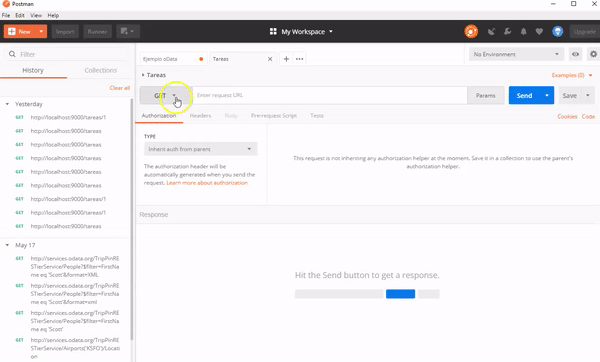
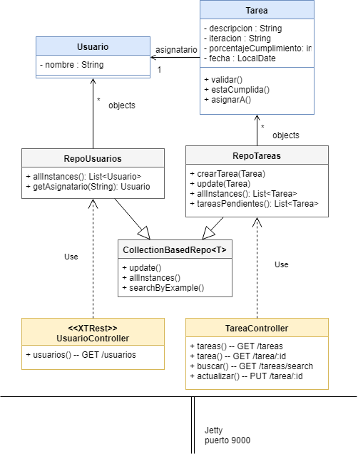

# XTRest - Tareas pendientes de un equipo de Desarrollo

[](https://travis-ci.org/uqbar-project/eg-tareas-xtrest)

## Dominio

Este ejemplo permite actualizar y mostrar las tareas pendientes que tiene un equipo de desarrollo. Los objetos de dominio involucrados son:

- tareas, a las que le hacemos un seguimiento y las asignamos a
- usuarios


## Servicios REST

El main del controller principal levanta el servidor HTTP [Jetty](https://www.eclipse.org/jetty/) en el puerto 9000:

```xtend
def static void main(String[] args) {
	XTRest.start(9000, UsuariosController, TareasController)
}
```

Los controllers que tenemos disponibles son UsuariosController y TareasController.


### Cómo levantar el servidor REST

Las opciones para probarlo (ya sea con POSTMAN o una aplicación cliente) son las siguientes:

- desde el Eclipse, seleccionar TareasController.xtend y con botón derecho ejecutar la opción: Run As > Java Application 
- o bien desde la línea de comando (Git Bash o una terminal de Linux) ejecutar la siguiente instrucción

```
$ mvn clean compile assembly:single
```

Esto genera un _jar_, o archivo comprimido donde están los .class necesarios para levantar la aplicación. Luego escriben en la línea de comando

```
$ java -jar target/tareas-angular-xtrest-0.0.1-SNAPSHOT-jar-with-dependencies.jar
```

El nombre del jar puede variar, deben buscarlo en el directorio target del raíz. Entonces visualizarán en la consola el log del servidor levantado:

```bash
INFO  - log                        - Logging initialized @164ms
INFO  - Server                     - jetty-9.2.z-SNAPSHOT
INFO  - ServerConnector            - Started ServerConnector@4a831c6d{HTTP/1.1}{0.0.0.0:9000}
INFO  - Server                     - Started @611ms
```


### Rutas

Una vez levantado el servidor, escriban la siguiente URL http://localhost:9000/ en su navegador preferido, que les mostrará la lista de rutas disponibles:


Con un cliente HTTP como Postman, pueden disparar pedidos al servidor. Por ejemplo, para listar las tareas pendientes:

- Pedido GET
- URL http://localhost:9000/tareas

Pero también para ver los datos de una tarea en particular, como la que tiene el identificador 1 (que en XTrest se define como parámetro :id):

- Pedido GET
- URL http://localhost:9000/tareas/1



Para modificar una tarea, podemos hacer un pedido PUT que contenga la nueva información de la tarea. Esto lo podemos hacer copiando el JSON que nos devuelve como respuesta la ruta http://localhost:9000/tareas/1 y pegándolo en el body de nuestro request PUT. El siguiente video ilustra esta situación:


### Implementación

#### Objeto de dominio Tarea

Es interesante ver la definición **del objeto de negocio Tarea** ya que en lugar de publicar la propiedad fecha como un LocalDate, lo hace como String formateándolo a día/mes/año. Esto se logra mediante dos anotaciones: @JsonIgnore para el atributo fecha (para que el serializador no lo tome en cuenta), y @JsonProperty con el nombre de la propiedad a publicar. Vemos a continuación cómo es la definición en el código:

```xtend
@Accessors
class Tarea extends Entity {
	static String DATE_PATTERN = "dd/MM/yyyy"
	...
	@JsonIgnore LocalDate fecha

	...
	
	@JsonProperty("fecha")
	def getFechaAsString() {
		formatter.format(this.fecha)
	}
	
	def formatter() {
		DateTimeFormatter.ofPattern(DATE_PATTERN)
	}
```

Del mismo modo, la propiedad asignatario se oculta para publicar otra llamada "asignadoA" que es un String. Esto lo hacemos por motivos didácticos más que nada:

```xtend
@Accessors
class Tarea extends Entity {
	@JsonIgnore Usuario asignatario
	...
	@JsonProperty("asignadoA")
	def String getAsignadoA() {
		if (asignatario === null) {
			return ""
		}
		asignatario.nombre
	}
}
```

#### Controllers de Tarea - GET

Veamos los métodos get:

```xtend
	@Get("/tareas")
	def Result tareas() {
		val tareas = RepoTareas.instance.allInstances //tareasPendientes
		ok(tareas.toJson)
	}

	@Get('/tareas/:id')
	def Result tarea() {
		val iId = Integer.valueOf(id)
		try {
			ok(RepoTareas.instance.searchById(iId).toJson)
		} catch (UserException e) {
			notFound("No existe la tarea con id " + id + "")
		}
	}
```

La annotation @Get("/tareas") define 

- que utilizará el método http GET 
- para la ruta "/tareas" desde el servidor donde se publique el _jar_ (por eso para invocarla desde Postman es http://localhost:9000/tareas)

La búsqueda 1) se delega al repositorio, y la respuesta 2) se serializa a JSON en base a las definiciones del objeto de negocio (el mensaje toJson de XTRest, en la clase JSONUtils). Por último, 3) el método ok devuelve un estado http 200 + el JSON con la lista de tareas.


#### Controllers de Tarea - PUT

Ahora veremos el método que permite actualizar una tarea:

```xtend
@Put('/tareas/:id')
def Result actualizar(@Body String body) {
	try {
		//if (true) throw new RuntimeException("ACHALAY")
		val actualizado = body.fromJson(Tarea)

		actualizado.asignarFecha(body.getPropertyValue("fecha"))
		
		val asignadoA = body.getPropertyValue("asignadoA")
		val asignatario = RepoUsuarios.instance.getAsignatario(asignadoA)
		actualizado.asignarA(asignatario)

		if (Integer.parseInt(id) != actualizado.id) {
			return badRequest('{ "error" : "Id en URL distinto del cuerpo" }')
		}

		RepoTareas.instance.update(actualizado)
		ok('{ "status" : "OK" }');
	} catch (Exception e) {
		badRequest(e.message)
	}
}
```

La annotation @Put define la ruta "/tareas/:id" como método http PUT. Los parámetros que se le inyectan son:

- el identificador o id, dentro de la ruta, demarcado con el prefijo dos puntos (:id). Para el caso de http://localhost:9000/tareas/2, el valor 2 se asigna a la variable id dentro del contexto del método actualizar()
- por otra parte, la annotation @Body dentro del parámetro del método actualizar permite recibir un JSON y asignarlo a la variable body

La implementación del método actualizar requiere transformar el body (JSON) al objeto Tarea. No obstante, será necesario **adaptar** las propiedades fecha y asignatario en base a la información que viene en el JSON. Para ello enviamos el mensaje _body.getPropertyValue_ que permite capturar la información del JSON y convertirla a LocalDate para la fecha de la tarea, y en el caso del asignatario debemos buscarlo en el repositorio de usuarios, para luego asignarla.

Una vez que se actualiza, se envía el status 200 y el JSON `{ "status": "OK" }`. En caso de haber un error, o bien si no se encuentra el elemento a actualizar, dado que no podemos tirar una excepción dentro del contexto del server, devolvemos un status 400 (Bad Request).


## Diagrama general de la arquitectura



# Testing

En la carpeta src/test/java podrás encontrar los casos de prueba unitarios para el objeto de dominio Tarea. No tenemos por el momento pruebas automatizadas para los controllers XTRest.
