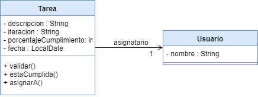
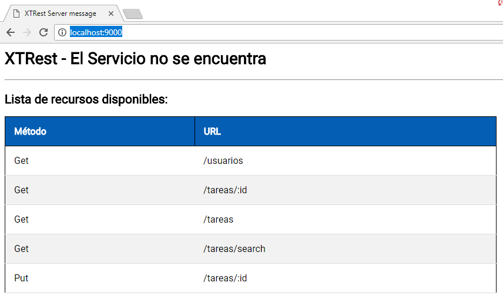
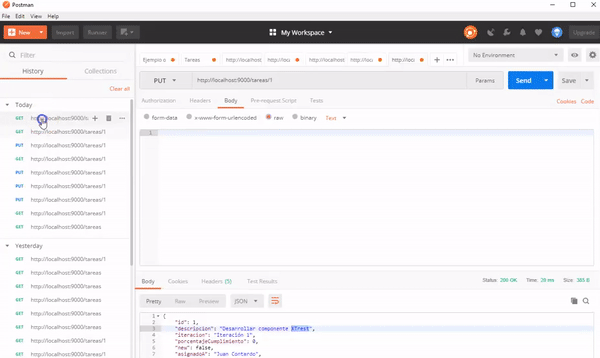

# XTRest - Tareas pendientes de un equipo de Desarrollo

[](https://travis-ci.org/uqbar-project/eg-tareas-xtrest)

## Dominio

Este ejemplo permite actualizar y mostrar las tareas pendientes que tiene un equipo de desarrollo. Los objetos de dominio involucrados son:

- tareas, a las que le hacemos un seguimiento y las asignamos a
- usuarios




## Servicios REST

El main del controller principal levanta el servidor HTTP [Jetty](https://www.eclipse.org/jetty/) en el puerto 9000:

```xtend
def static void main(String[] args) {
	XTRest.start(9000, UsuariosController, TareasController)
}
```

Los controllers que tenemos disponibles son UsuariosController y TareasController.


### Cómo levantar el servidor REST

Las opciones para probarlo (ya sea con POSTMAN o una aplicación cliente) son las siguientes:

- desde el Eclipse, seleccionar TareasController.xtend y con botón derecho ejecutar la opción: Run As > Java Application 
- o bien desde la línea de comando (Git Bash o una terminal de Linux) ejecutar la siguiente instrucción

```
$ mvn clean compile assembly:single
```

Esto genera un _jar_, o archivo comprimido donde están los .class necesarios para levantar la aplicación. Luego escriben en la línea de comando

```
$ java -jar target/tareas-angular-xtrest-0.0.1-SNAPSHOT-jar-with-dependencies.jar
```

El nombre del jar puede variar, deben buscarlo en el directorio target del raíz. Entonces visualizarán en la consola el log del servidor levantado:

```bash
INFO  - log                        - Logging initialized @164ms
INFO  - Server                     - jetty-9.2.z-SNAPSHOT
INFO  - ServerConnector            - Started ServerConnector@4a831c6d{HTTP/1.1}{0.0.0.0:9000}
INFO  - Server                     - Started @611ms
```


### Rutas

Una vez levantado el servidor, pueden ir a su navegador preferido y buscar la URL http://localhost:9000/, que les mostrará la lista de rutas disponibles:



Con un cliente HTTP como Postman, pueden disparar pedidos al servidor. Por ejemplo, para listar las tareas pendientes:

- Pedido GET
- URL http://localhost:9000/tareas

Pero también para ver los datos de una tarea en particular, como la que tiene el identificador 1 (que en XTrest se define como parámetro :id):

- Pedido GET
- URL http://localhost:9000/tareas/1


Para modificar una tarea, podemos hacer un pedido PUT que contenga la nueva información de la tarea. Esto lo podemos hacer copiando el JSON que nos devuelve como respuesta la ruta http://localhost:9000/tareas/1 y pegándolo en el body de nuestro request PUT. El siguiente video ilustra esta situación:




### Implementación

Objetos de dominio: properties especiales

propiedad new que XTrest enmascara

## Diagrama general de la arquitectura

TODO: viene un pedido del éter y por el caño del 9000 responde el servicio

## Testing

TODO
